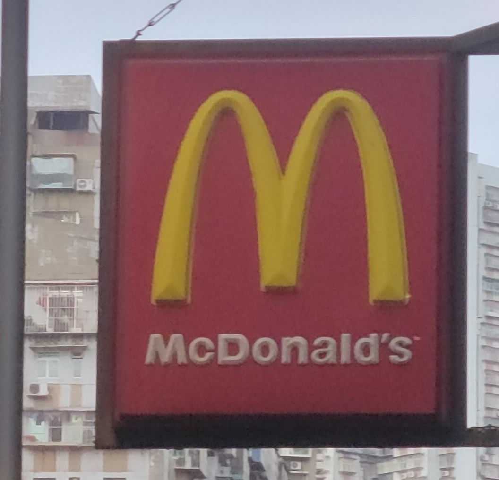
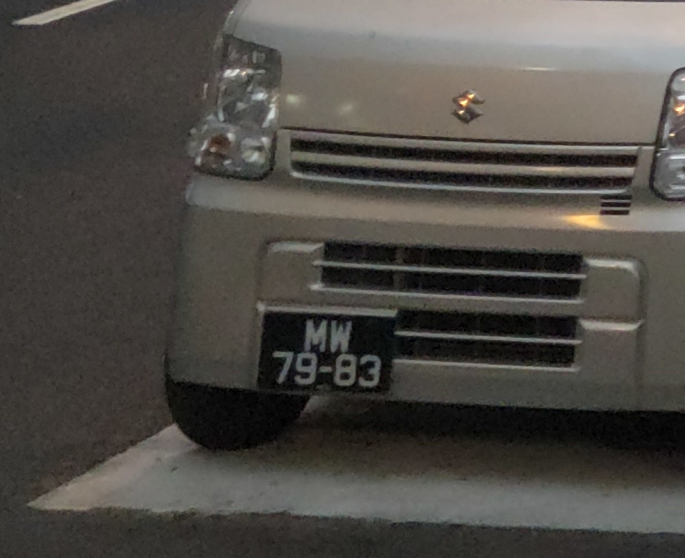
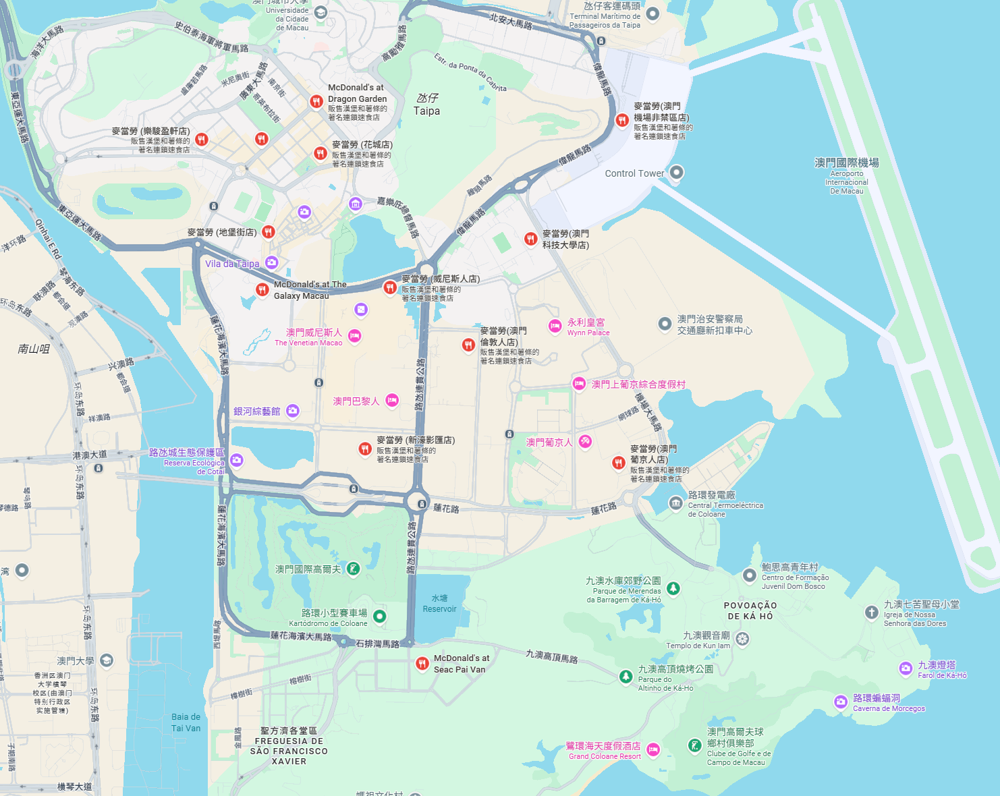
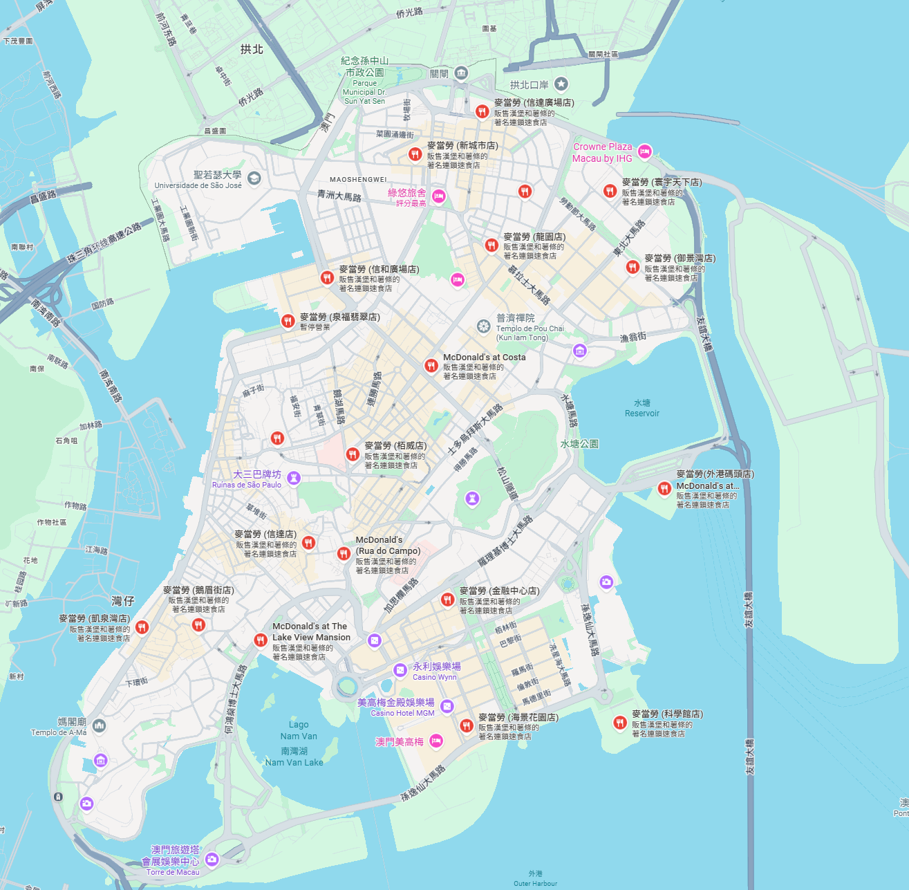
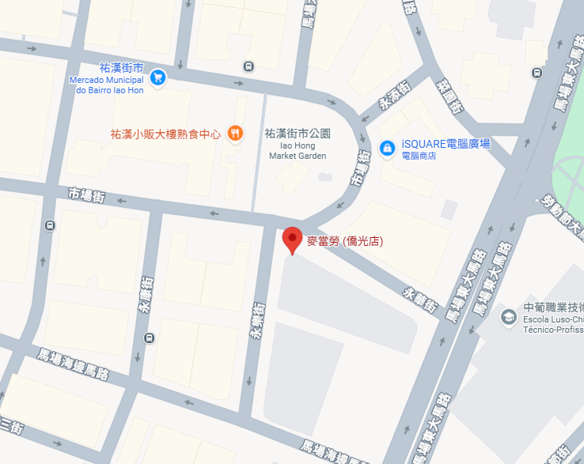
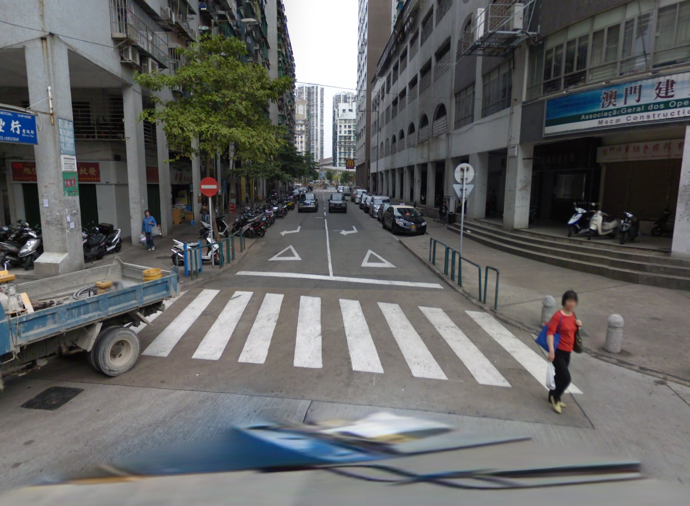
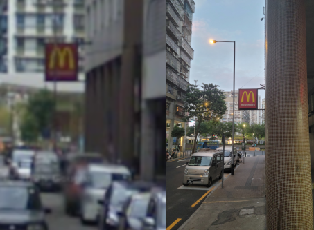
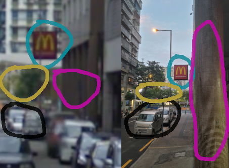

# Catch that Arcadeholic - Writeup

## Files related to solving the challenge are in root folder

## Please open issue should you have any questions. It will be added to the respective Q&A section

Author: S051_Destroy Lai Lai's Machine (aka DLLM)

OS: Geoguessr ahh challenge

## Situation

Catch that Arcadeholic

Jeffrey is one of the member in Nuttyshell, but he is addicted to video arcade games now and don't want to play CTF for a lifetime.\
We hacked his phone and found some photos from his gallery that might help us to find him, can you help us to find him?

Flag format: PUCTF25{\<street_name_with_underscore\>_\<xxx.xxx_xxx.xxx(geolocation_of_the_location_in_the_image)\>}\
PS: The first letter of the street name should be capitalized, e.g. foo bar street should be written as Foo_Bar_Street, the decimal places of the geolocation should be three digits without rounding.

Author: SleepyJeff\
Flag Format: PUCTF25{[a-zA-Z_]+\_[0-9]{2}\\.[0-9]{3}\_[0-9]{3}\\.[0-9]{3}}

Hint: N/A

Attachments:\
`chall.jpg`\
(Stored at `./chall.jpg`)

## The Beginning

To find the location of an image, of course we try to rip it's exif data out and take a look

```none
ExifTool Version Number         : 12.57
File Name                       : chall.jpg
Directory                       : .
File Size                       : 14 MB
File Modification Date/Time     : 2025:04:27 11:27:03+08:00
File Access Date/Time           : 2025:04:27 11:36:30+08:00
File Inode Change Date/Time     : 2025:04:27 11:36:10+08:00
File Permissions                : -rwxrwxrwx
File Type                       : JPEG
File Type Extension             : jpg
MIME Type                       : image/jpeg
Exif Byte Order                 : Big-endian (Motorola, MM)
Orientation                     : Rotate 90 CW
X Resolution                    : 72
Y Resolution                    : 72
Resolution Unit                 : inches
Modify Date                     : 2023:12:30 17:54:04
Y Cb Cr Positioning             : Centered
Exposure Time                   : 1/50
F Number                        : 2.0
Offset Time                     : +08:00
Offset Time Original            : +08:00
Shutter Speed Value             : 1
Aperture Value                  : 2.0
Brightness Value                : 2.07
Exposure Compensation           : 0
Max Aperture Value              : 2.0
Focal Length                    : 5.9 mm
Sub Sec Time                    : 272
Color Space                     : sRGB
Exif Image Width                : 9248
Exif Image Height               : 6936
Exposure Mode                   : Auto
Digital Zoom Ratio              : 1
Scene Capture Type              : Standard
Image Unique ID                 : R12QSMF00SM
Padding                         : (Binary data 268 bytes, use -b option to extract)
Compression                     : JPEG (old-style)
Thumbnail Offset                : 1172
Thumbnail Length                : 40848
Image Width                     : 9248
Image Height                    : 6936
Encoding Process                : Baseline DCT, Huffman coding
Bits Per Sample                 : 8
Color Components                : 3
Y Cb Cr Sub Sampling            : YCbCr4:2:0 (2 2)
Aperture                        : 2.0
Image Size                      : 9248x6936
Megapixels                      : 64.1
Shutter Speed                   : 1/50
Modify Date                     : 2023:12:30 17:54:04.272+08:00
Thumbnail Image                 : (Binary data 40848 bytes, use -b option to extract)
Focal Length                    : 5.9 mm
```

well.... I don't think theres any hint to the image's location in the exif data\
(except the fact that the image was rotated 90 degree clockwise by the exif, don't think useful, just annoying)

I guess the only way to solve this is by playing geoguessr?

## The Beginning - checkpoint Q&A

Q - Why does this Q&A look unnecessary?\
A - Because I can't think of any Q&A here

## Hint searching

Let's see if there's any hints in the image


The first thing we see is a big ahh McDonalds sign



which means it's near mcdonalds

but... there are sooo many mcdonalds in Hong Kong??

Let's go for other hints

We know that the image is taken outdoor, so it's not mcdonalds inside some malls or etc\
The mcdonald is at a 3 way too

We can also see this car license



which after some googling it is in Macau

## Hint searching - checkpoint Q&A

Q - Cars with Macau license can also go to Hong Kong, why is this Macau\
A - Notice all cars that travels between Macau and Hong Kong need both HK and MO car license on them?\
This car only have MO license, no HK, therefore either this image is taken in Macau, or the car owner broke the law\
I'd rather believe in the former

## Brute force go brr

Good news is that there's only about 50 mcdonalds in Macau, in contrast to 260 mcdonalds in HK, so we can just search each of them and compare with the image.

in Taipa region, the mcdonalds are either not at a 3 way, inside hotel&mall, or doesn't match the image



in the other part idk the name, we found a few mcdonalds at outdoor 3 way



and after matching each of them with the image, we found this mcdonalds



with a street view [here](https://www.google.com/maps/@22.2095371,113.5519981,3a,75y,9.28h,77.1t/data=!3m7!1e1!3m5!1somueye0SFKJw6Dpi2fDGsg!2e0!6shttps:%2F%2Fstreetviewpixels-pa.googleapis.com%2Fv1%2Fthumbnail%3Fcb_client%3Dmaps_sv.tactile%26w%3D900%26h%3D600%26pitch%3D12.89703054516022%26panoid%3Domueye0SFKJw6Dpi2fDGsg%26yaw%3D9.281019211177188!7i13312!8i6656?entry=ttu&g_ep=EgoyMDI1MDQyMy4wIKXMDSoJLDEwMjExNDUzSAFQAw%3D%3D)



still can't see it? let's zoom in and compare





we've found the location, now we can get our flag

`PUCTF25{Rua_Alegre_22.210_113.552}`

## Brute force go brr - checkpoint Q&A

Q - why is the street view not at where the image is taken at?\
A - Sadly, google map didnt map the street view inside the streets where this image is taken at, so that street view is the closest we can get to
