# Catch that Arcadeholic - Writeup

## Files related to solving the challenge are in root folder

## Please open issue should you have any questions. It will be added to the respective Q&A section

Author: U060_hello world has been taken

OS: Last year only 1 geoguessr this year so many :skull::skull:

## Situation

Catch that Arcadeholic

One member of our CTF team went off to play music game arcade machines during PUCTF26 instead of staying to monitor the server.\
He even sent a picture and make laugh to us!!! Bloody annoying!\
Please help us to find his location base on his picture.\
Wait? What do you mean he took a flight to leave???\
==================================================\
flag format: PUCTF26{[Arcade brand name]_[Building brand name]_[Name of the suburb where the picture was taken]_[Postcode where the picture was taken]_[Nearest Bus stop's stop ID]_[Nearest Supermarket from the arcade centre]_[MD5 hash value of the challenge title name]}\
If there is space in the name, use "_" to replace\
Example: "Hello World" --> "Hello_World"

Author: SleepyJeff\
Flag Format: PUCTF26{[a-zA-Z0-9_]+_[a-fA-F0-9]{32}}

Hint: N/A

Attachments:\
`chall.jpg`\
(Stored at `./chall.jpg`)

## The Beginning

AYO IS THAT A MAIMAI ?!?!?!?!?!?!?

Well lets examine what do we need first

* Arcade brand name
* Building brand name
* Name of the suburb where the picture was taken
* Postcode where the picture was taken
* Nearest Bus stop's stop ID
* Nearest Supermarket from the arcade centre
* MD5 hash value of the challenge title name <- literally gift mark

So basically, locate the arcade and get the flag

## The Beginning - checkpoint Q&A

**Q - Why does this Q&A look unnecessary?**\
A - Because I can't think of any Q&A here

## Hint searching

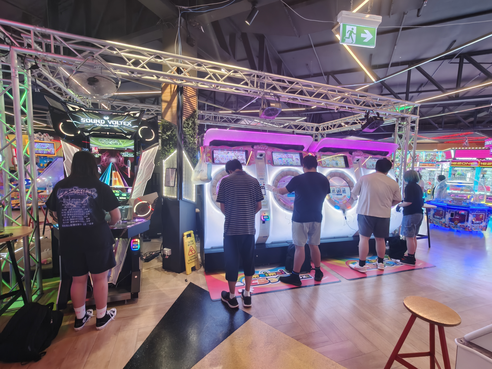

Since this is an arcade, lets begin by searching for games this arcade has

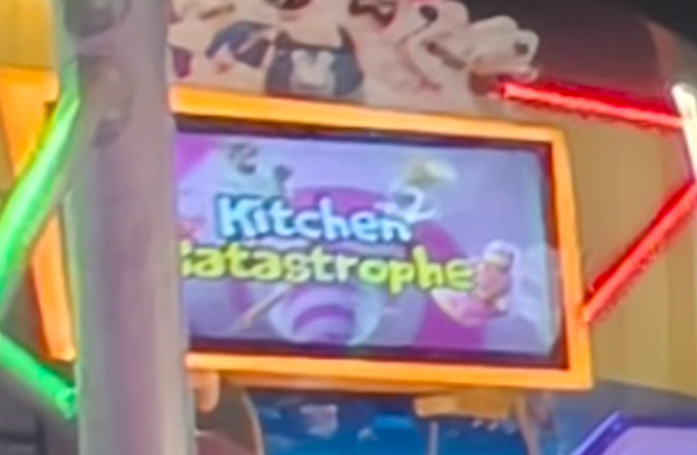

It seems like we have a `Kitchen Catastrophe`? Idk I cant find it online

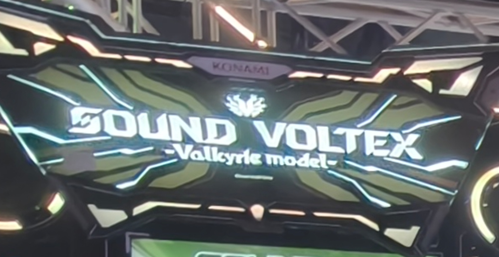

We also have a Sound Voltex Valkyrie Model

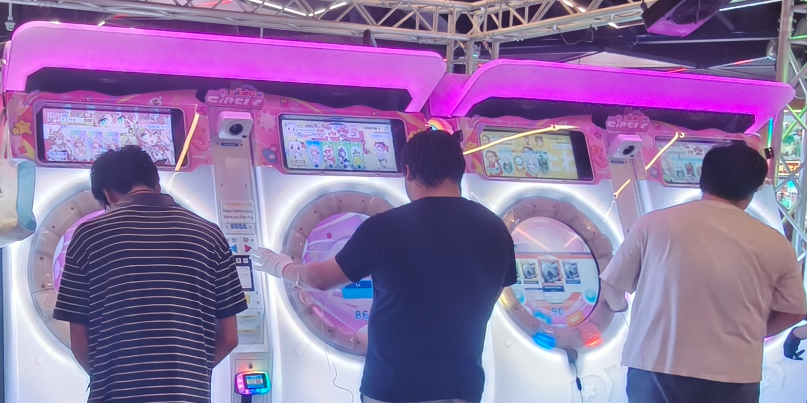

And of course, maimai

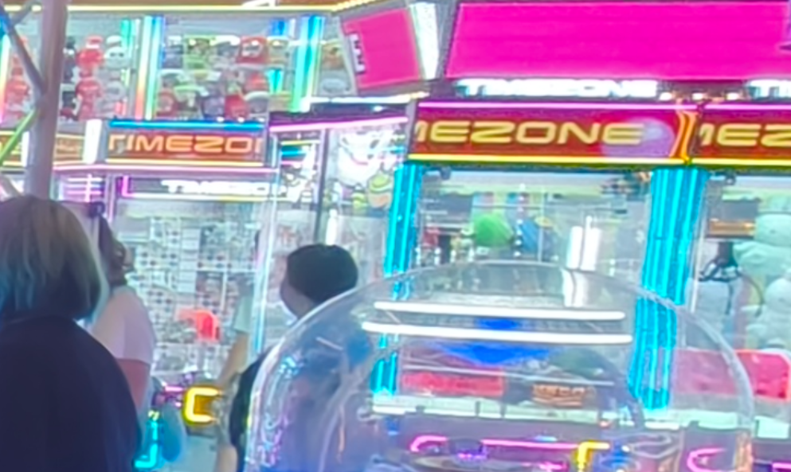

And some timezone claw machines?

We can also see an Australia exit sign

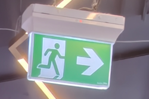

and also some truss surrounding the maimais?

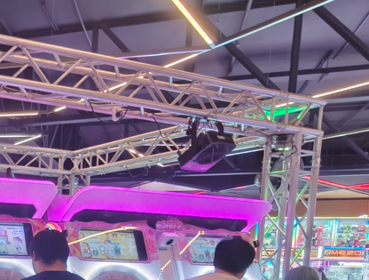

## Hint searching - checkpoint Q&A

**Q - Why does this Q&A look unnecessary?**\
A - Because I can't think of any Q&A here

## Googling go brr

First, In my opinion Sound Voltex is quite rare, so lets go look up where can I find Sound Voltexs

from [sdvx.org](https://www.sdvx.org/en/setup/arcade), we can see that we can specificly go to [vmsearch](https://www.vmsearch.net/vmsearch-map) to find valkyrie models, so lets go there and see australia SDVXs

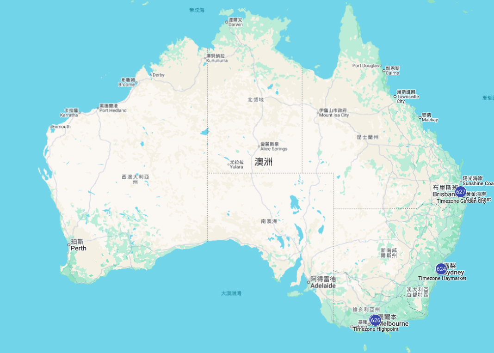

well, it seems that there isn't much SDVX in australia, thats good news because we got less workloads yay

It seems that we have 1 at Brisbane

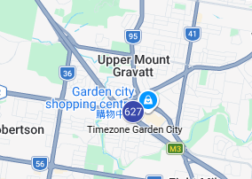

and 2 at Melbourne

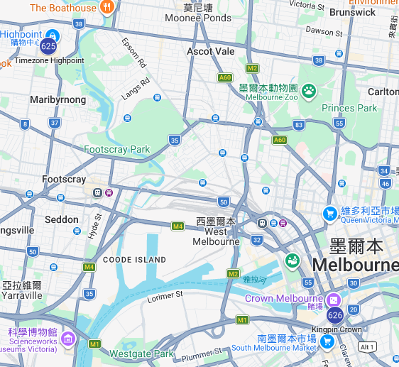

and also 2 at Sydney

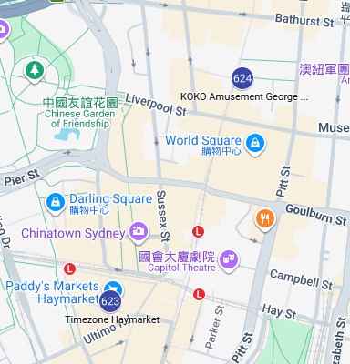

So lets find some pictures at these 5 arcades about their maimai and sdvx

Also hol'up before we go googling again, timezone is not a claw machine brand but an arcade brand? Well one flag part ticked off the checklist

## Googling go brr - checkpoint Q&A

**Q - Why don't you use [Ziv arcade database](https://zenius-i-vanisher.com/v5.2/arcades.php)? This one is also in sdvx.org**\
A - It seems that there is only 2 valkyrie sdvx from ziv but 5 in vmsearch, so I assume that ~~ziv got skill issue and ~~ the data are outdated. Always increase your workload to prevent overlooking important info

## Compare the arcades

Lets gather some pictures of them

In melbourne, we have 2 arcades

At Highpoint

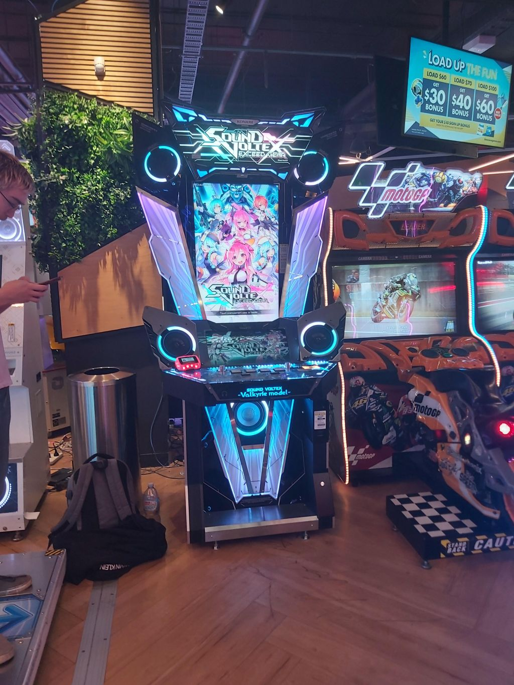

-# from [reddit](https://www.reddit.com/r/rhythmgames/comments/12d847l/welcoming_sdvx_to_timezne_highpoint/)

There is no maimai next to the sdvx, OUT!

At kingpin crown, this is not even a timezone arcade, OUT!

------

In Sydney, we also have 2 arcades

At KOKO Amusement, this isn't even a timezone arcade, OUT!

At Haymarket

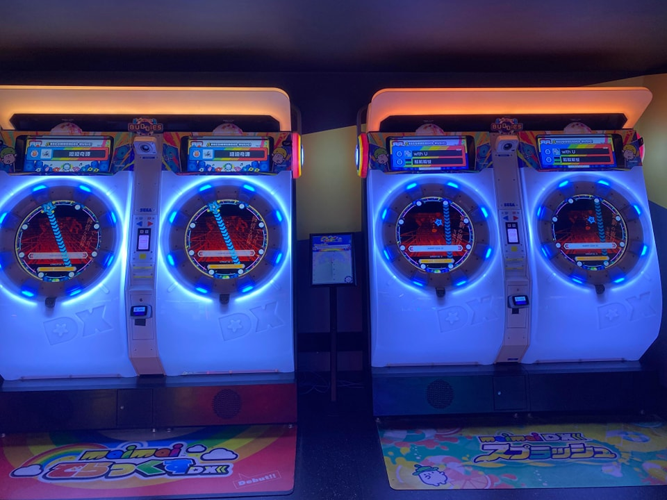

-# from [facebook](https://www.facebook.com/photo/?fbid=936887014900857)

The maimais are right in front of the wall, and there is no truss, OUT!

------

In Brisbane, we only have 1 arcade, since all other 4 arcades are out I think this should be it, but let's double check.

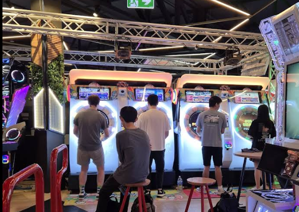

-# from [google map](https://www.google.com/maps/place/Timezone+%26+Zone+Bowling+Garden+City/@-27.5625793,153.0799418,3a,75y,90t/data=!3m8!1e2!3m6!1sCIHM0ogKEICAgICflcfC_AE!2e10!3e12!6shttps:%2F%2Flh3.googleusercontent.com%2Fgps-cs-s%2FAHVAwer82einXBU16SsyWasCkrzG2gfqGcz04P7recHaqSAJME81CBxCvXZk-Ph2rPYFzf6zS50_uLboZW_D38PHdvpqS3g3xNZxajMx4y236Opn6O--3JFYojtT9-biwVdxqn8G4PVe%3Dw203-h270-k-no!7i3000!8i4000!4m7!3m6!1s0x6b9145ada0fa24d9:0x5b347b7c5239e9d4!8m2!3d-27.5625793!4d153.0799418!10e5!16s%2Fg%2F11g_zk2bws?entry=ttu&g_ep=EgoyMDI2MDMxMS4wIKXMDSoASAFQAw%3D%3D)

PERFECT! The truss matches, slightly sees the sdvx on the left, and the exit sign and the grassy pillar and etc

So we found out arcade, Timezone Garden City

## Compare the arcades - checkpoint Q&A

**Q - Why instant out non-timezone arcades?**\
A - Because I can't find any evidence that timezone is a claw machine brand as well, so a claw machine with timezone on it got to be a timezone arcade

## Get the flag

[Its google map](https://www.google.com/maps/place/Timezone+%26+Zone+Bowling+Garden+City/@-27.5625889,153.0803448,18.37z/data=!3m1!5s0x6b9144cada11382f:0x64dca853b2db2785!4m6!3m5!1s0x6b9145ada0fa24d9:0x5b347b7c5239e9d4!8m2!3d-27.5625793!4d153.0799418!16s%2Fg%2F11g_zk2bws?entry=ttu&g_ep=EgoyMDI2MDMxMS4wIKXMDSoASAFQAw%3D%3D)

Recall what we need

* Arcade brand name - `Timezone`
* Building brand name - Westfield Mt Gravatt -> `Westfield`
* Name of the suburb where the picture was taken - `Upper Mount Gravatt`
* Postcode where the picture was taken - Queensland Brisbane -> `4122`
* Nearest Bus stop's stop ID - Garden City Shopping Centre interchange stop A -> `006515`
* Nearest Supermarket from the arcade centre - `Woolworths`
* MD5 hash value of the challenge title name - `06a4701552bbe840158857946dcb5853`

stitch them together and we get

### the flag

`PUCTF26{Timezone_Westfield_Upper_Mount_Gravatt_4122_006515_Woolworths_06a4701552bbe840158857946dcb5853}`

## Get the flag - checkpoint Q&A

**Q - :moyai:**\
A - I don't think we need a Q&A for the flag lol
